# Live Member Face Recognition Deployment
## Project Description
The purpose of this project is to develop a more efficient way to verify memberships and grant access to members without unnecessary delays. <br>
This issue exists in places like Costco, sporting events, and other venues where long queues form just to validate entry credentials.<br>
The goal is to eliminate long wait times by allowing members to gain access seamlessly through facial recognition, reducing the need for manual verification
<!-- 3‑column CSS grid. Fill in as many <figure> blocks as you have images. -->
<div style="display: grid; grid-template-columns: repeat(3, 1fr); gap: 1rem; justify-items: center;">
  <figure style="margin: 0; text-align: center;">
    
    <figcaption style="font-size: 0.75em; color: #555;"></figcaption>
  </figure>
  <figure style="margin: 0; text-align: center;">
    
    <figcaption style="font-size: 0.75em; color: #555;"></figcaption>
  </figure>
  <figure style="margin: 0; text-align: center;">
    
    <figcaption style="font-size: 0.75em; color: #555;"></figcaption>
  </figure>
  <!-- Duplicate or add more <figure> blocks here for a full 3×3 grid -->
</div>
<br>
Pciture 1: Created by ChatGPT               Picture 2 Found on Pexels.com created by Pavel Danilyuk   Picture 3 Found on Pexels.com created by Tiger Lily 

## Project Proposal

To solve this problem, I developed a real-time face recognition system using computer vision.  
In [Practicum 1: YOLOv8 Model](https://github.com/johnmunoz777/LMFD_MSDS_Practicum) I built a YOLOv8 face recognition model.  
The purpose of Practicum 2 was to deploy this model to Hugging Face Spaces so anyone can add themselves to the Members database, and obtain predictions from the Yolo V8 Model <br>
Furthermore, the website [facedetectiondemo](https://facedetectiondemo.com/) was created so employees can validate members in real time via a webcam

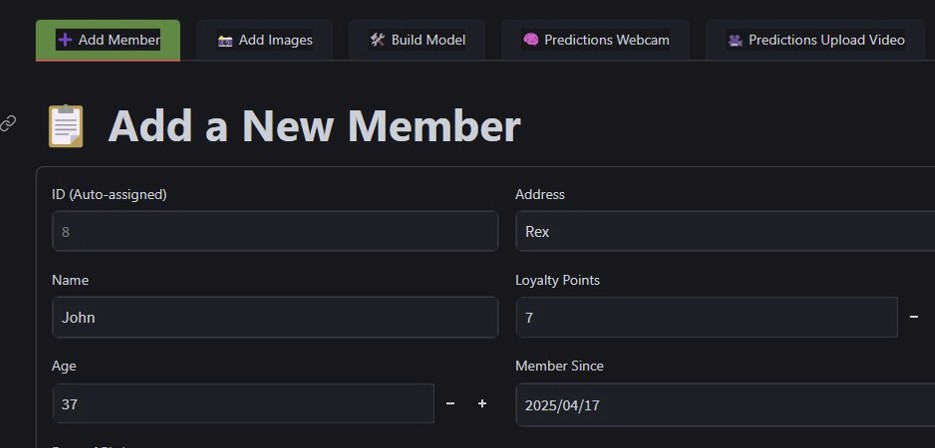
<br>
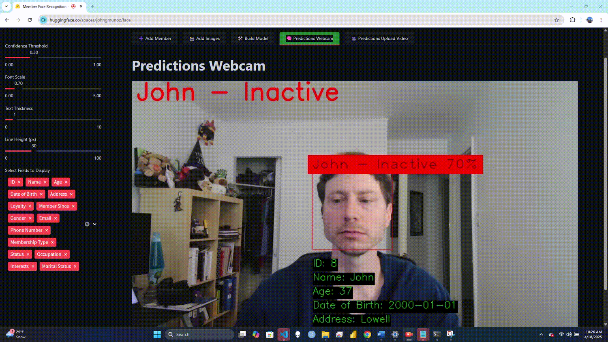
<br>


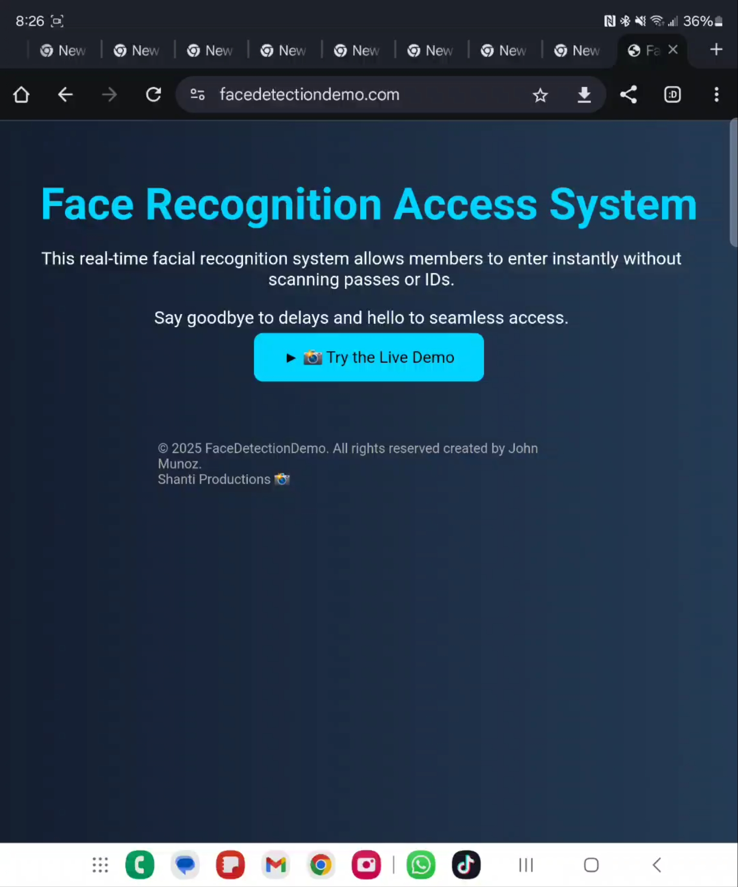
<br>

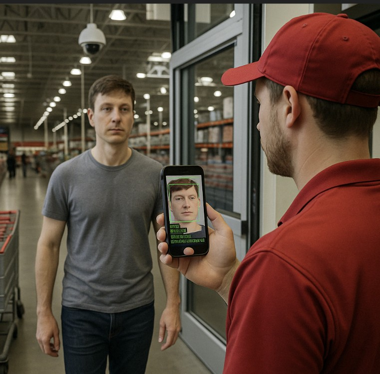

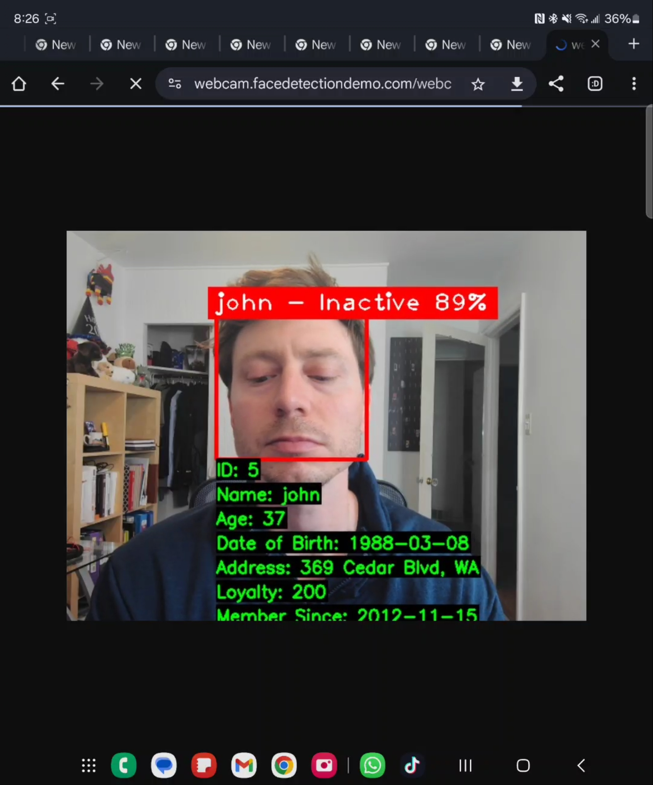

## System Overview
This system leverages an sqlite members database, OpenCV, YOLO for object detection, Hugging Face Spaces for the dahsboard, Cloudflared,and Flask for the employee website <br>
By implementing this solution, venues such as Costco and retail stores can have frictionless, secure, and efficient entry for their members.


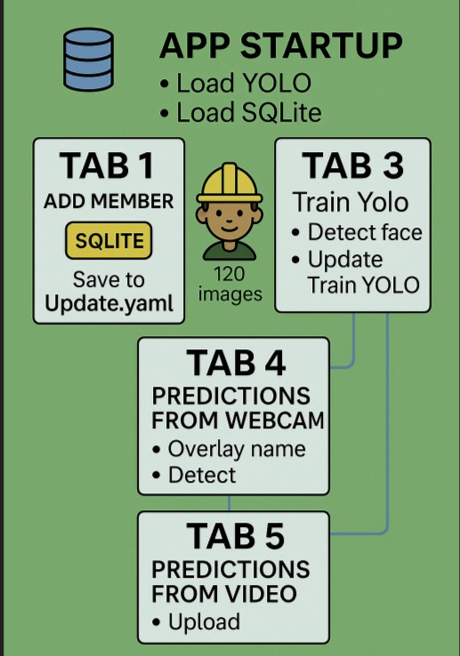 <br>
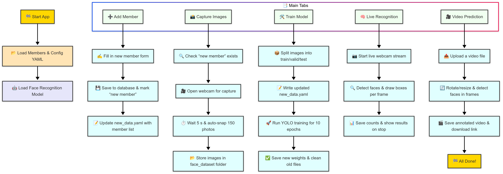
<br>
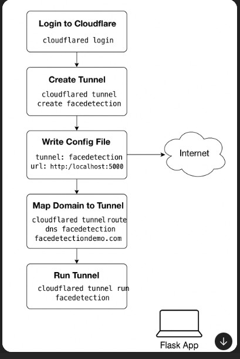
<br>

### Table of Contents  
- [Yolo Model Comparison](#Model-Comparison)  
- [Setting Up Hugging Face Space](#Setting-Up-Hugging-Face-Space)  
- [Hugging Face Space](#Hugging-Face-Space)  
- [Face Detect Website](#Face-Detect-Website)
- [File Information](#File-Information)
- [Future Implementations](#future-implementations)


### Yolo Model Comparison

### Models Trained
I developed two final models for my project. <br>
* Large Yolo Model- this Model contained 14 individuals and had on average around 300 images per class
* Small Yolo Model- this Model contained 7 individuals which had on average around 100 images per class

# Prepare Yolo Data Large Model Example

To prepare the images for the YOLO v8 object detection model, I used OpenCV to detect faces within the images. Specifically, I employed the Haar Cascade classifier with the haarcascade_frontalface , an algorithm widely used for object detection, especially for faces. Once a face was detected, I generated a `.txt` file containing the volunteer's ID, the `x_center`, `y_center`, `width`, and `height` of the detected face.

I created a Python function that:

- Splits the images into training, validation, and test sets according to specified split ratios.
- Generates YOLO-formatted `.txt` annotation files for each image by detecting faces.
- Copies both the images and annotation files into their corresponding output folders.
- Finaly, data.yaml file linked the path,train,validation, number_of_classes

The folder structure for the output is as follows:
```bash
output_base/
    ├── train/
    │   ├── images/
    │   └── labels/
    ├── valid/
    │   ├── images/
    │   └── labels/
    └── test/
        ├── images/
        └── labels/

        
```
# Dataset Paths and Configuration
* This is an Example of how I setup the Large Yolo Model
* The Large Yolo Model had 14 individuals in contrast the Small Yolo Model contained 7 Individuals

```yaml
path: /content/drive/MyDrive/capstone project/my_data_split
train: /content/drive/MyDrive/capstone project/my_data_split/train/images
val: /content/drive/MyDrive/capstone project/my_data_split/val/images
test: /content/drive/MyDrive/capstone project/my_data_split/test/images
nc: 14
names: ['angela', 'classmate', 'giuliana', 'javier', 'john', 'maite', 'mike', 'ron', 'shanti', 'tom', 'vilma', 'will','Kevin','Shirley']
```

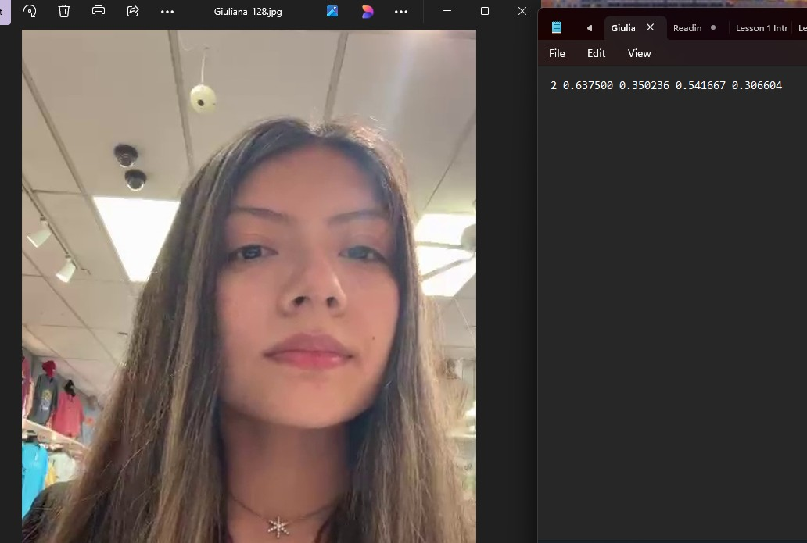

### Building the YOLO Model
I used the Ultralytics package to build the Yolo v8 model <br>
`!yolo task=detect mode=train model=yolov8l.pt data="/content/drive/MyDrive/capstone project/data.yaml" epochs=50 imgsz=640`

- Overall Model Performance

Large Model mAP@50: 90% → On average, the Yolo v8 model detects objects correctly 90% of the time at an IoU threshold of 0.50. <br>
Small Model mAP@50: 85% → On average, the Yolo v8 model detects objects correctly 85% of the time at an IoU threshold of 0.50.<br>
Large Model Precision (P): 89% → Out of all detected objects, 89% were correctly classified.  <br>
Large Model Precision (P): 81% → Out of all detected objects, 81% were correctly classified.   <br>

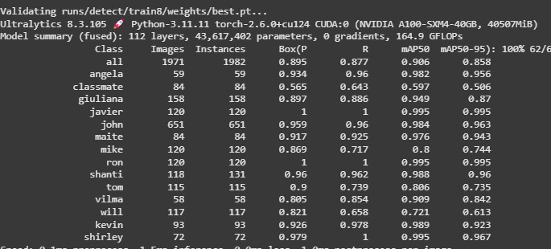

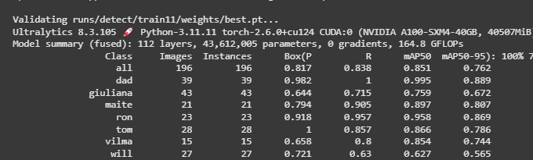

### Confuision Matrix
- Both models achieved very similar **overall accuracy** when evaluated with their confusion matrices.  
- Performance varied by class—some identities had higher **recall** than others.  
- **Large model:**  
  - Angela class **recall** was nearly perfect.  
  - Will class **recall** was the lowest, at 68%.  
- **Small model:**  
  - Dad class **recall** hit 100%, though the limited sample size suggests possible overfitting.  
  - Will class **recall** was the lowest, at 63%.

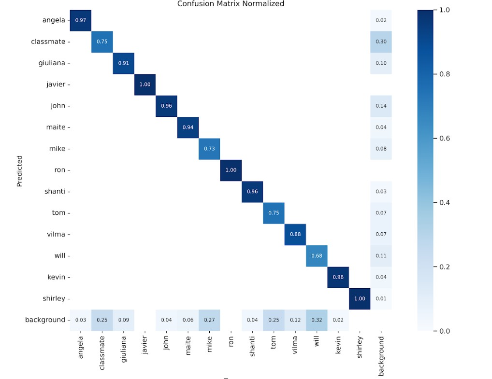
<br>

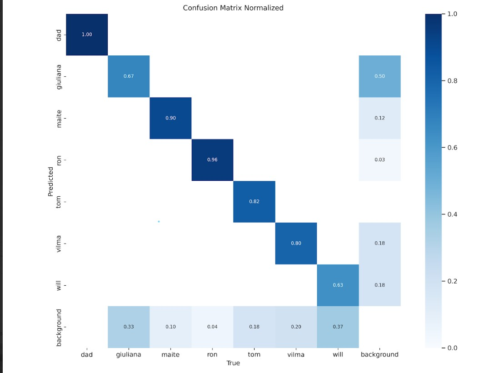
<br>

## Model Used For Hugging Space
Due to Hugging Face Spaces storage limits, I ultimately used the **small YOLO model**.<br>
The following shows training images for both models 

* Lare Yolo Model
  
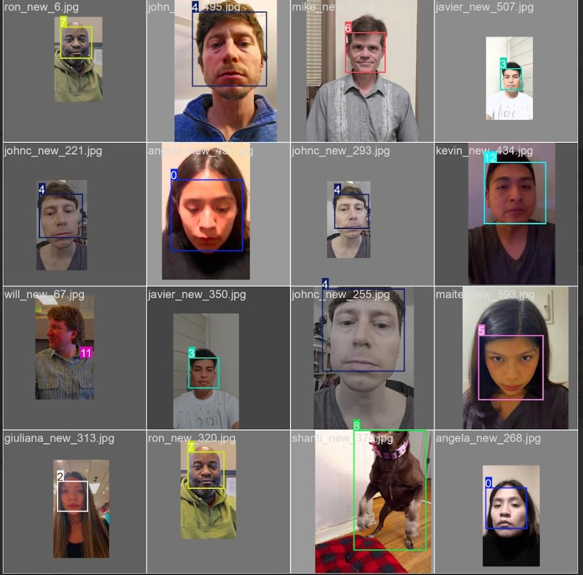
<br>

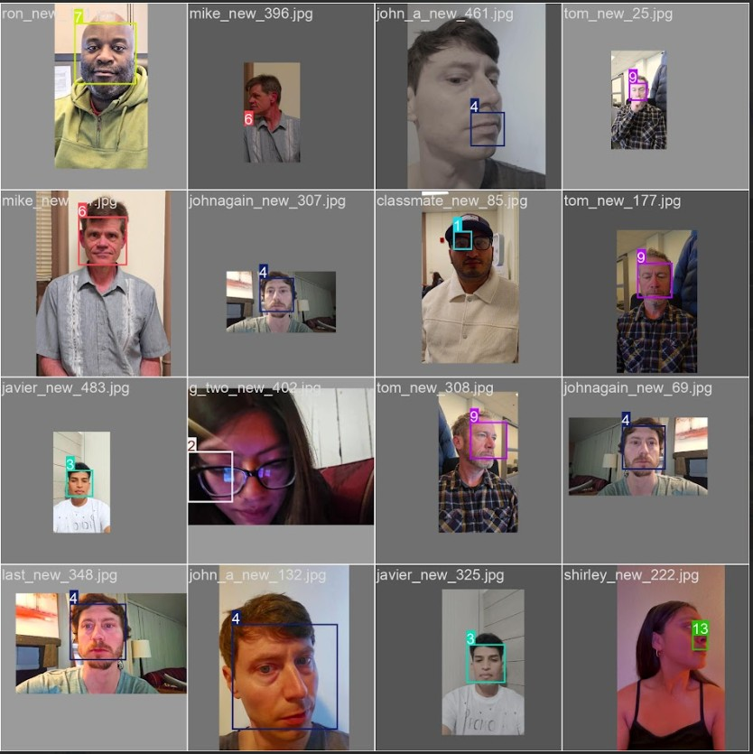
<br>

* Small Yolo Model 

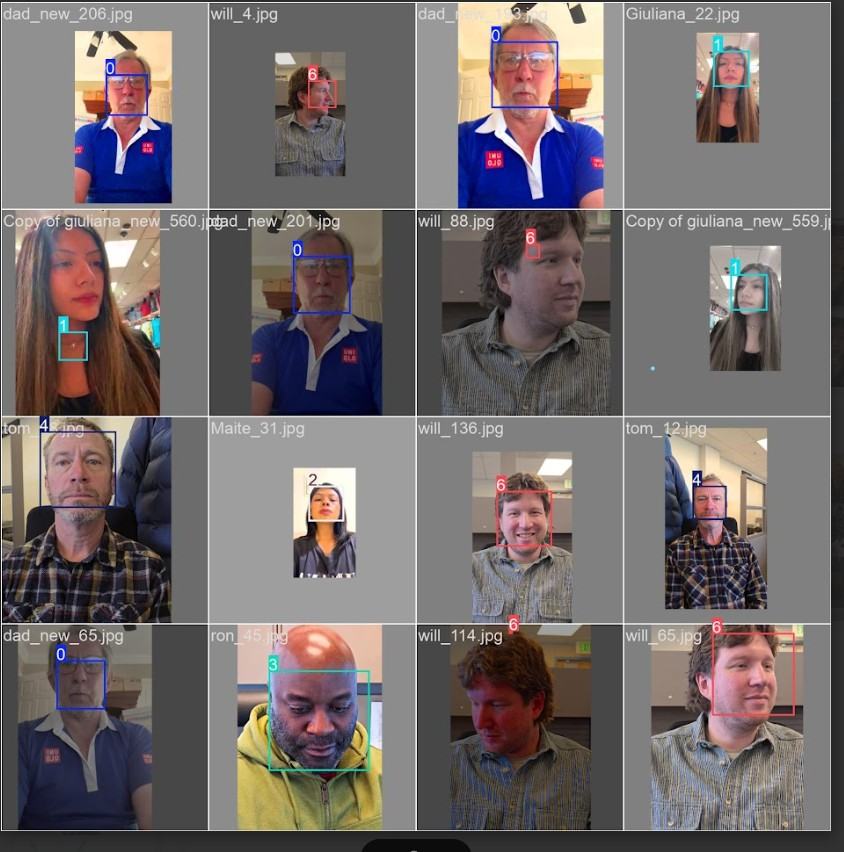
<br>

### Setting Up Hugging Face Space

## Hugging Face Space Setup Guide

## 1. Account Setup
1. Go to [Hugging Face](https://huggingface.co/) and **Sign Up** or **Log In**.  
2. Verify your email address if prompted.

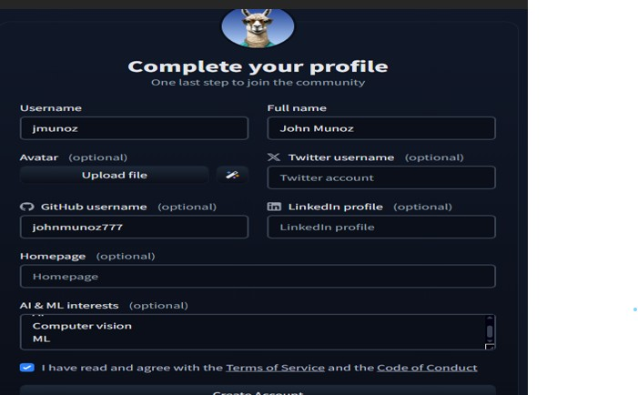

## 2. Create a New Space
1. Navigate to **Spaces** (top menu or https://huggingface.co/spaces).  
2. Click **Create new Space**.  
3. **Name** your Space: `johnmunoz/face-recognition-demo`.  
4. **Select SDK** → **Streamlit**.  
5. **Hardware** → leave as **CPU (Basic)** (you can switch to GPU later).

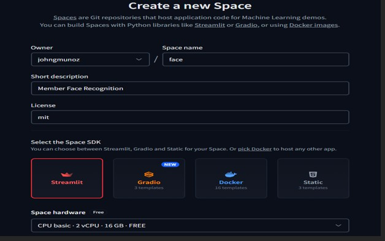

## 3. Prepare Your Project Files
In a local folder named `hugging_face_space/`, create and populate:


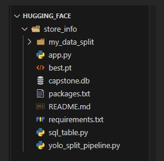

## 4. Install & Authenticate the Hugging Face CLI
* 4.1 Install the CLI
pip install huggingface_hub
* 4.2 Login with your token
huggingface-cli login
# → Paste your access token when prompted <br>


## 5. Push Your Code to the Space
* Clone the (empty) Space repo <br>
git clone https://huggingface.co/spaces/johnmunoz/face-recognition-demo <br>
cd face-recognition-demo  <br>
* 5.2 Copy your local files into the repo
* cp -r ../hugging_face_space/* .

* 5.3 Commit and push
git add .  <br>
git commit -m "Initial commit: Streamlit app, weights, requirements"  <br>
git push <br>
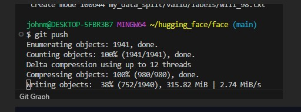
## 6. Configure Twilio & Environment Variables
Sign up or log in at Twilio.<br>
Create a new API Key (you will get an Account SID and Auth Token).<br>
In your Space on Hugging Face:<br>
Go to Settings → Environment variables.Add <br>
TWILIO_ACCOUNT_SID = <your Account SID><br>
TWILIO_AUTH_TOKEN  = <your Auth Token><br>

<br>


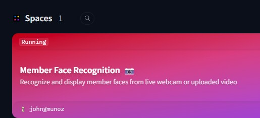

## 7. Deployment & GPU Enablement
After you git push, the Space will auto‑build and deploy your Streamlit app.<br>
To enable GPU (for faster inference or webcam streaming):<br>
In the Space, open Settings → Hardware.<br>
Toggle Use GPU to On.<br>
Click Save and wait for the container to rebuild with GPU suppor<br>
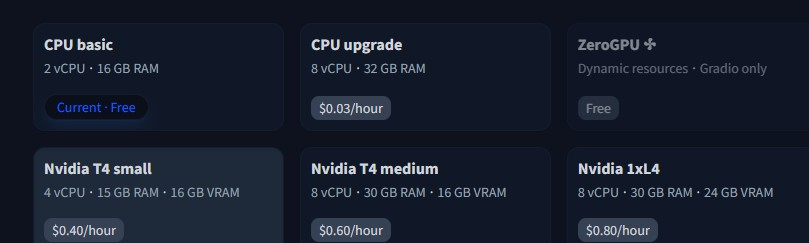

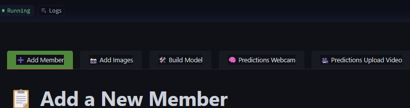

### Hugging Face Space

The Space for the Project is located at [Hugging Face Space – johngmunoz/face](https://huggingface.co/spaces/johngmunoz/face)  <br>
In this Space, anyone can add themselves to the Members Database and perform face recognition using either a webcam or by uploading a video. <br>
Due to Cost issues its running on a CPU, but a GPU can be enabled for faster detection and model creation <br>
The Space Starts with the Small Yolo Model | Model Weights| Members Database | image_folder & add the .yaml files <br>
The structure is as follows <br>
📂 **Hugging Face Space – johngmunoz/face** <br>
├─ ➕ **Add Member**  
├─ 🖼️ **Add Images**  
├─ 🛠️ **Build Model**  
├─ 📹 **Prediction (Webcam)**  
└─ 📤 **Prediction (Upload Video)**

# 1. Add a New Member
* Any individual can add themself to the project
* A new user will fill out the required fields 
* Once filled out the user hits Submit
* Once they hit submit the .yaml file is updated with the person's name and # of classes
* In addition, the SQL database is updated with the individuals name & Variables
* If a user wants to edit or delte themself they can hit the delete button
  
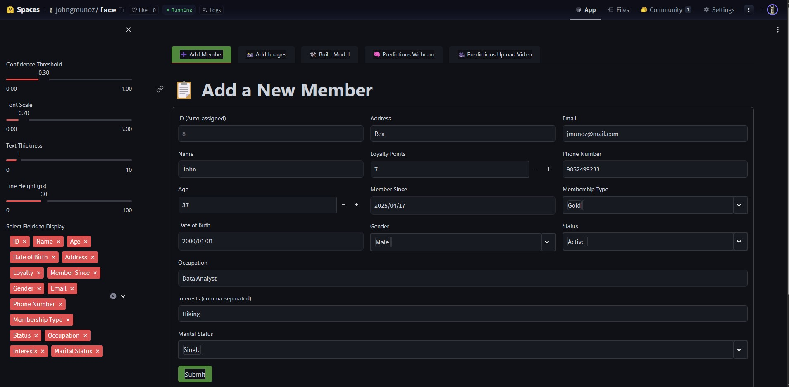

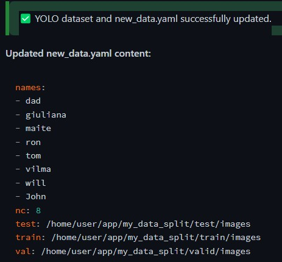

# 2. Add Images
- The next step is to use a webcam to extract still frames
- By default, 150 images will be collected.  
- All photos are saved in a temporary folder at `face_dataset/person_<name>`.  
- To clear and retake images, click the **Reset Face Dataset** button.  


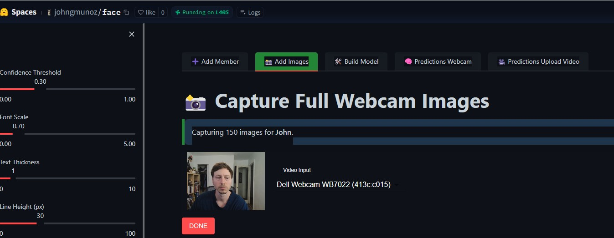

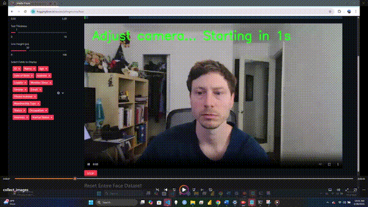

## 3. Build Model

After the User creates their images the next step is to build the model:

1. **Organize the images**  
   All photos from `face_dataset/person_<name>` are automatically split into training, validation, and test sets.

2. **Update the configuration**  
   The system rewrites `new_data.yaml` to point at those three folders, sets the total number of members (classes), and lists their names.

3. **Clean up temporary files**  
   The original `face_dataset` folder is deleted to free up storage.

4. **Train the YOLO detector**  
   Using the updated YAML, a new model is trained for a fixed number of rounds, with earlier layers optionally frozen for faster convergence.

5. **Save the new weights**  
   The freshly trained weights are saved under a descriptive name (e.g. `person_<name>.pt`), and the cumulative weights file (`new_person_detect.pt`) is updated. The intermediate training weights are then removed.

6. **Archive previous outputs**  
   Any existing `runs` folder is moved into `old_run` so your workspace stays clean for the next training cycle.

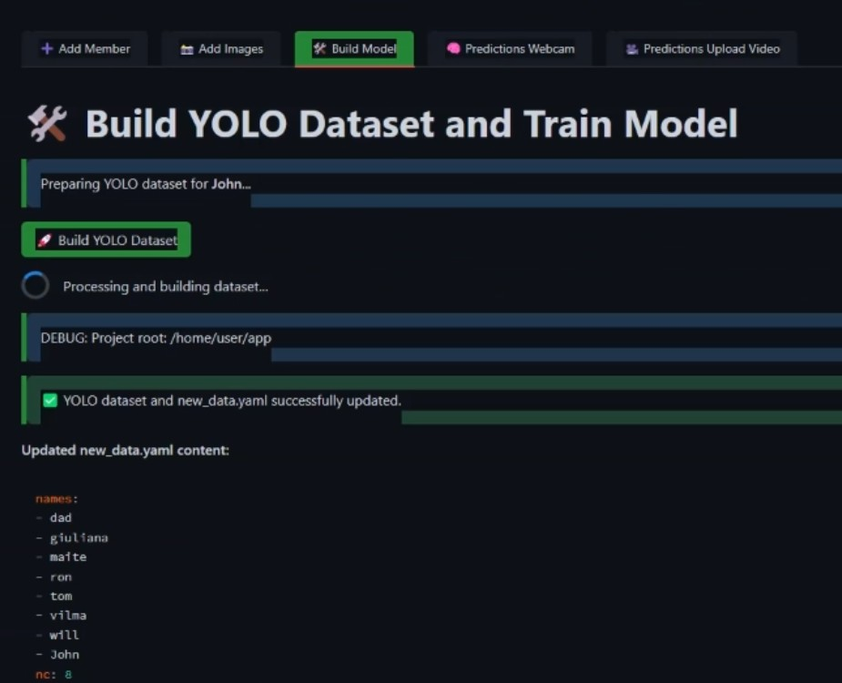

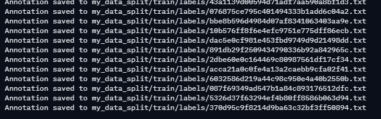

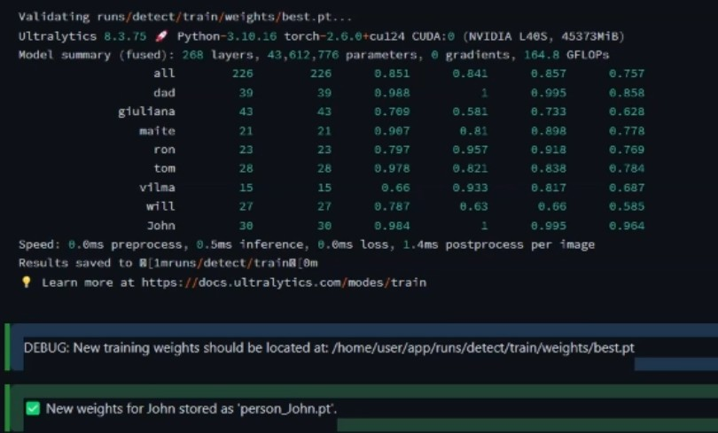


## 4 Predication Webcam
1. **Start the live feed**  
   - Switch to the “Prediction (Webcam)” tab and click the webcam button to begin streaming.

2. **Load the latest model**  
   - The app automatically loads your most recent `new_person_detect.pt` weights for detection.

3. **Detect faces in real time**  
   - Each video frame is passed through the YOLO detector.
   - When a face is found, the app checks your Members Database:
     - **Green box** for recognized (active) members  
     - **Red box** for unrecognized or inactive faces  

4. **Show confidence and member info**  
   - Confidence scores (as percentages) appear next to each box.  
   - Selected member fields (from the sidebar) are displayed beneath the detection.

5. **Fine‑tune display settings**  
   - Use the sidebar sliders to adjust:
     - **Confidence Threshold** – ignore low‑confidence detections  
     - **Font Scale & Text Thickness** – control label size  
     - **Line Height** – set spacing for member details  

6. **Stop and review results**  
   - Click “Show Results” after ending the stream to see:
     - A summary table of detections by person  
     - The highest‐frequency detection highlighted  
     - An annotated image of the top detection  
   - Download the table (CSV) and image for your records.


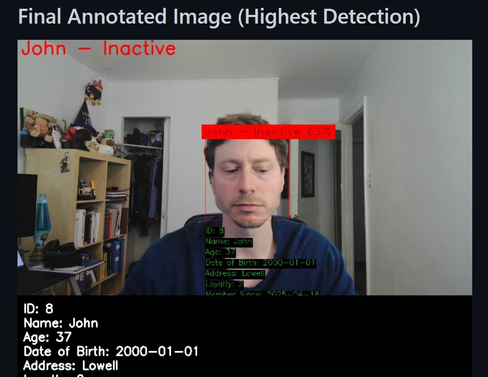

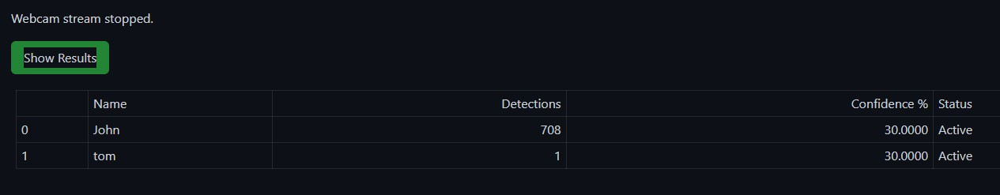

## 5. Prediction (Upload Video)

1. **Upload your video**  
   - Click the **Upload Video** button and select an MP4, MOV, or AVI file.

2. **Configure processing options**  
   - **Rotate Video**: Choose to rotate or flip the footage.  
   - **Adjust Scale**: Use the slider to zoom in/out on the preview.  
   - **Output Width & Height**: Enter your desired resolution for the processed file.  
   - **Sidebar Controls**: Tweak the **Confidence Threshold**, **Font Scale**, **Text Thickness**, and **Line Height** to refine detections.

3. **Run detection**  
   - Hit **Process Video** to analyze each frame with the latest model.  
   - Faces are boxed (green for known members, red for unknown) and labeled with names and confidence scores.

4. **Review results**  
   - A summary table lists each person’s detection count, confidence percentages, and status.  
   - Download this table as a CSV for your records.

5. **Save your video**  
   - When processing finishes, click **Download Processed Video** to get the annotated file.

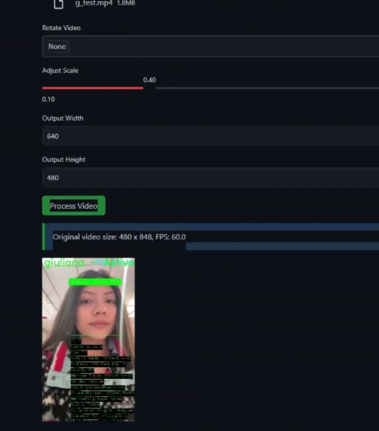


### Face Detect Website
### Face Detection Demo Deployment
* Overview:
This solution provides a secure, branded web portal (`facedetectiondemo.com`) where employees simply click “Start Webcam” to engage real‑time face recognition. Behind the scenes, a Cloudflare Tunnel protects your infrastructure, a lightweight Flask service runs the AI model on GPU, and a volunteer database ensures only authorized users are recognized. No client‑side installations are needed—just a browser—making it easy for non‑technical staff to use.


 <br>


# Setting up Face Detection Website
## Domain & DNS Setup  
- **Domain**: Purchased `facedetectiondemo.com`.  
- **DNS**: Pointed a CNAME (or A) record at `tunnel.cloudflare.com` per Cloudflare instructions.

## Static Page Deployment  
- Added an `index.html` under `pages/` for `facedetectiondemo.com`.  
- This page hosts a “Start Webcam” button that connects users to the live face‑recognition app. <br>
 <br>
## 1. Create Tunnel  
Set up a Cloudflare Tunnel named `face-detect-tunnel` to securely expose your local server. <br>

## 2. Start Flask Server  
Run the Flask app on your machine. It loads the YOLO model on GPU (if available) and uses an SQLite database for volunteer profiles. <br>
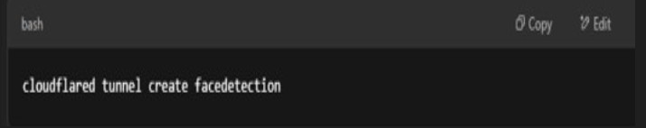
## 3. App Interface  
The web UI shows a live webcam feed with colored bounding boxes, confidence scores, and profile details.<br>
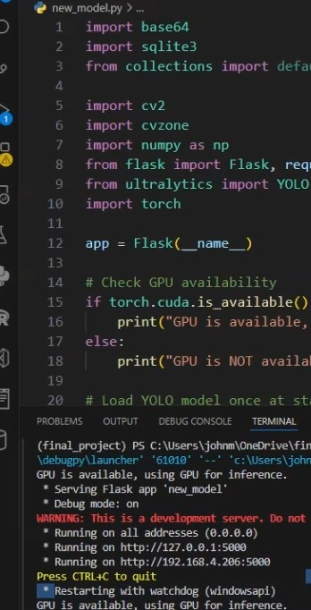
## 4. Start Tunnel   
Launch the tunnel to forward public traffic from `facedetectiondemo.com` to your local Flask server.<br>
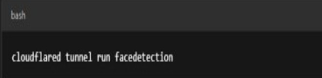
## 5. Tunnel Process  <br>
Monitor tunnel logs to confirm incoming requests are routed correctly.<br>
<br>
## 6. Tunnel Configuration    
Your `.cloudflared/config.yaml` defines tunnel credentials and maps `/*` to `http://localhost:5000`.<br>
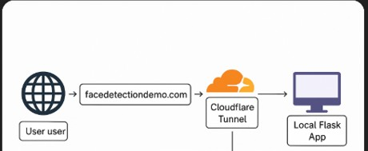<br>
## 7. Run the Tunnel  <br>
Keep the tunnel running continuously so employees can access the site at any time.<br>
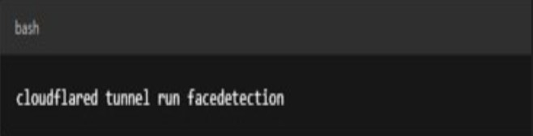 <br>
Once everything is running, employees visit **https://facedetectiondemo.com**, click the button, and see real‑time face recognition powered by your YOLO model and volunteer database.

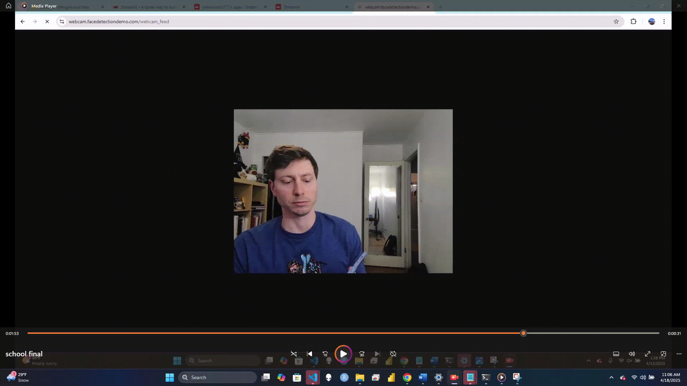

<br>

### File Information
# 📁 Project Structure

This repository is organized by functionality to streamline development, deployment, and maintenance.

## 🖼️ Data & Assets
- **`my_data_split/`**  
  Contains training images and their labels for model fine‑tuning.  
- **`images/`**  
  Static images for documentation and UI (e.g., example screenshots).

## 🚀 App Deployment (Hugging Face Space)
- **`app.py`**  
  Streamlit application entry point for deploying on Hugging Face Space.  
- **`requirements.txt`**  
  Python packages required by the app.  
- **`packages.txt`**  
  System‑level dependencies for container builds.

## 🤖 YOLO Model
- **`best.pt`**  
  Trained YOLOv8 weights for real‑time face detection and recognition.  
- **`new_data.yaml`**  
  YOLO data configuration file (paths, class names, etc.).  
- **`yolo_split_pipeline.py`**  
  Script to extract frames from videos and organize them into training folders.

## 🗃️ Database
- **`capstone.db`**  
  SQLite database file defining and storing the `members` table.  
- **`sql_table.py`**  
  Module for creating the table and performing CRUD operations on `members`.

## 📦 Web App for FaceDetectionDemo.com
- **`index.html`**  
  Static landing page for the FaceDetectionDemo.com website.  
- **`new_model.py`**  
  Flask application configured for GPU inference and model serving.


